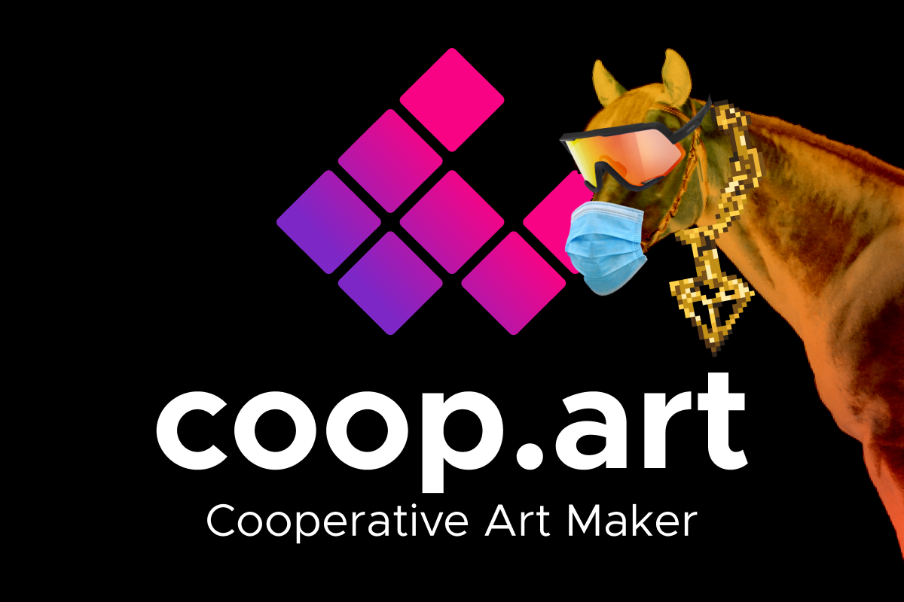

## About Coop.art

**Coop.art** [ koh-op-ahrt ] is a tool allowing artist on Tron to create a canvas cooperatively. The process is:

1. An artist create a new canvas and becomes its admin.
2. He and other artists can contribute to it by adding new layers (potentialy semi-transparent for great effects).
3. Anyone can vote on a layer giving the admin insight about the quality of a layer and its integration with the rest of the canvas.
4. Finally, at some point, the admin selects some layers, merge them and mint a TRC721 NFT.
5. The NFT is sold on a marketplace like ApeNFT, and each artist that contibuted to the final canvas will receive a share of the sale (Coop.art sets up royalties automaticaly in the metadata based on the final number of layers during the merge).

(Note the custom Tron Pendant art we created ^^)

## Inspiration

I first got the idea to create Coop.art from looking at the [$69 million Beeple's NFT](https://www.theverge.com/2021/3/11/22325054/beeple-christies-nft-sale-cost-everydays-69-million). The piece of art is made from 5,000 tiles merged together into a common canvas. I thought it would be great if each tile was made by a different author, and so Coop.art was born. Many artists can contribute layers to a common canvas that is then sold as a single piece, and profits are shared between all of them.

## Getting started

The platform is live at [coop.art](https://coop.art) and running on the _Tron Shasta Testnet_. I coded the smart contract in Solidity and integrated the frontend with IPFS for token metadata upload and storage.

Click _Connect wallet_ and TronLink will open to ask you for authorization. Your Tron address should then appear in the top right corner.

### Create a new canvas

You are now ready to create a new canvas or contribute to the existing canvases. If you click `Create New Canvas`, you can see the canvas editor with an empty canvas. Click _Add New Layer_ and choose an image file. I am using **IPFS** with _Infura_ to store the NFT images and metadata, so it is fully decentralized and layer owners can be reassured that their art is stored safely forever.

Once the image is uploaded, it appears in the canvas. There you can move it around and resize it. Zoom in and out of the canvas with your wheel, and move around by drag&droping the canvas. This is an infinite canvas, you can go crazy! Once you are done, click _Mint layer_ in the right panel to save it in the smart contract. A Tron transaction automatically starts.

Click confirm to start the minting transaction. A notification in the top right corner tells you that the transaction has been sent. Wait a few seconds, and another notification will tell you that the layer has been minted. You can check out TronScan to confirm that the transaction is indeed successful. This canvas is now officially started. You can add more layers yourself or wait for others to contribute. The first contributor (you) become the admin of the canvas and is at any time able to select layers, merge them and mint the final NFT. More on that below.

## Contribute to existing canvas

Head over to `Ongoing Canvases` to see canvases you can contribute to. You should see the canvas you just created with one layer. Click any ongoing canvas to open the editor. This will fetch the existing layers from the smart contract. You can now contribute a new layer. When you are done, come back to _Ongoing Canvases_ page to see the updated canvas.

## Vote on layers

Now, what if someone ruins a canvas with an inappropriate layer? That's where voting comes into play. If you believe a layer should not be in a canvas, you can downvote it to be removed. On the contrary, if you believe a layer is a perfect match for the canvas, you can upvote it to keep it up. If a layer has more downvotes than upvotes, it is hidden by default. Ultimatly, the admin of the canvas is the one that will choose the layers to add or remove from the canvas mint, but this will help him choose. (We first wanted to code fully decentralized version with no admin, like each canvas being its own DAO, but realized this wouldn't work, people with more voting powers could overtake the initial vision of the first layer artist, so we decided on a more centralized approach.)

## Sell canvas

After a certain period, the admin of a canvas will decide to close it by selecting and merging the final layers into a merged art. Coop.art takes care of everthing, it was quite difficult to automate everything but this makes things much easier for artists. The admin can click `Close and Mint Canvas`, coop.art fuses the selected layers (and discards the unselected ones), uploads the final art to IPFS then generates the NFT metadata with royalties setup automatically based on the contribution of each artist. E.g., if a canvas has 5 final layers, each layer creator will receive 20%. If someone contributed 2 layers to that canvas, he will receive 40% royalties. The canvas is compliant with TRC721 and can be sold on any markeplace such as ApeNFT.

## Conclusion

Coop.art is a revolutionary way of making NFT art cooperatively. Cooperative art will lead to exceptional and new kind of artistic pieces from thousands of artists working together and hopefully one day worth millions.
